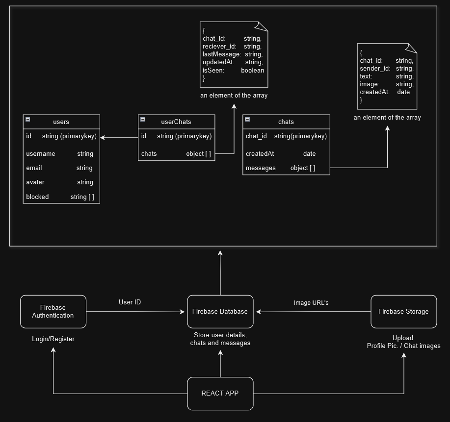

```markdown
# Real-Time Chat Application

This is a real-time chat application built using Firebase, Vite, Zustand, and Toastify. The project also utilizes ESLint for linting and npm for package management.

## Features

- Real-time messaging with Firebase
- State management with Zustand
- Notifications with Toastify
- Linting with ESLint
- Fast development with Vite
- Emoji support with `npm emoji`

## Getting Started

### Installation

1. Clone the repository:

    ```sh
    git clone https://github.com/yourusername/your-repo-name.git
    cd your-repo-name
    ```

2. Install the dependencies:

    ```sh
    npm install
    ```

### Running the Application

To start the development server, run:

```sh
npm run dev
```

In the termial you will get the Local Host link

## Project Structure



## Available Scripts

In the project directory, you can run:

- `npm run dev`: Starts the development server.
- `npm run build`: Builds the app for production.
- `npm run lint`: Runs ESLint to check for linting errors.

## Configuration

### Firebase

Ensure you have a Firebase project set up.

```javascript
// src/lib/firebase.js

import { initializeApp } from 'firebase/app';
import { getFirestore } from 'firebase/firestore';

const firebaseConfig = {
  apiKey: "YOUR_API_KEY",
  authDomain: "YOUR_AUTH_DOMAIN",
  projectId: "YOUR_PROJECT_ID",
  storageBucket: "YOUR_STORAGE_BUCKET",
  messagingSenderId: "YOUR_MESSAGING_SENDER_ID",
  appId: "YOUR_APP_ID"
};

const app = initializeApp(firebaseConfig);
const db = getFirestore(app);

export { db };
```

### Zustand

State management is handled by Zustand. A sample store might look like this:

```javascript
// src/lib/chatStore.js

import create from 'zustand';

const useChatStore = create(set => ({
  messages: [],
  addMessage: (message) => set(state => ({ messages: [...state.messages, message] })),
}));

export default useChatStore;
```

### Toastify

For notifications, Toastify can be used as follows:

```javascript
// Example usage in a component
import { toast } from 'react-toastify';
import 'react-toastify/dist/ReactToastify.css';

toast.success("Message sent!");
```

## Contributors

- [Pihul Lalotra](https://github.com/Pihul13)
- [Rohan Kumar Mahato](https://github.com/RohanKrMahato)

Happy coding! 🎉
```
Feel free to adjust the content as per your project specifics.